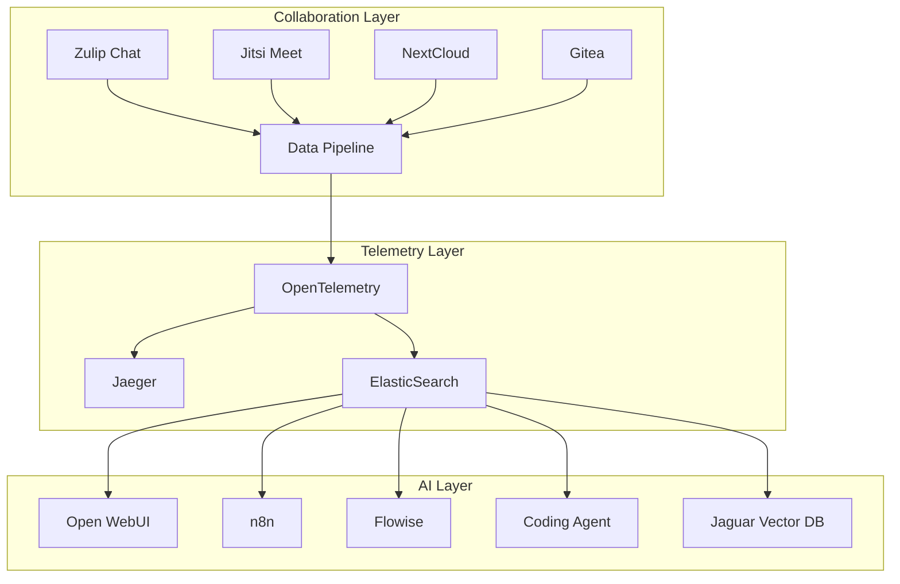

# OpenOrg-HiveMind
Create an OpenSource Brain for your Organization.

**OpenSource Everything** - A comprehensive package that combines Dockerized OpenSource Projects into a unified Hive Mind for your Open Organization.

## 🚀 Quick Start

```bash
git clone https://github.com/The-Spatial-Network/OpenOrg-HiveMind.git
cd OpenOrg-HiveMind
docker-compose up -d
```

## 📋 Overview

OpenOrg-HiveMind is designed to provide organizations with a complete, self-hosted ecosystem of collaboration, monitoring, and AI tools. All components are interconnected, allowing AI tools to access and analyze data from collaboration and telemetry systems.

## 🤝 Collaboration Tools

| Tool | Purpose | Default Port | Documentation |
|------|---------|--------------|---------------|
| **[Zulip Chat](https://zulip.com/)** | Team communication and chat | 8080 | [Zulip Docs](https://zulip.readthedocs.io/) |
| **[Jitsi Meet](https://jitsi.org/)** | Video conferencing | 8443 | [Jitsi Handbook](https://jitsi.github.io/handbook/) |
| **[NextCloud](https://nextcloud.com/)** | File sharing and collaboration | 8081 | [NextCloud Admin Manual](https://docs.nextcloud.com/server/latest/admin_manual/) |
| **[Git](https://git-scm.com/)** | Version control (Gitea) | 3000 | [Gitea Documentation](https://docs.gitea.io/) |

## 📊 Telemetry & Monitoring

| Tool | Purpose | Default Port | Documentation |
|------|---------|--------------|---------------|
| **[OpenTelemetry](https://opentelemetry.io/)** | Observability framework | 4317/4318 | [OpenTelemetry Docs](https://opentelemetry.io/docs/) |
| **[Jaeger](https://www.jaegertracing.io/)** | Distributed tracing | 16686 | [Jaeger Documentation](https://www.jaegertracing.io/docs/) |
| **[ElasticSearch](https://www.elastic.co/)** | Search and analytics | 9200 | [Elasticsearch Guide](https://www.elastic.co/guide/en/elasticsearch/reference/current/index.html) |

## 🤖 AI & Automation

| Tool | Purpose | Default Port | Documentation |
|------|---------|--------------|---------------|
| **[Open WebUI](https://github.com/open-webui/open-webui)** | LLM interface | 3001 | [Open WebUI Docs](https://docs.openwebui.com/) |
| **[n8n](https://n8n.io/)** | Workflow automation | 5678 | [n8n Documentation](https://docs.n8n.io/) |
| **[Flowise](https://flowiseai.com/)** | Low-code LLM apps | 3002 | [Flowise Docs](https://docs.flowiseai.com/) |
| **Coding Agent** | AI-powered development | 8082 | TBD |
| **[Jaguar](https://github.com/jaguar-database/jaguar)** | Vector database | 8888 | [Jaguar Docs](https://www.jaguardb.com/documentation/) |

## 🔗 Integration & Data Flow



## 🛠️ Architecture

The HiveMind architecture follows a three-tier approach:

1. **Collaboration Layer**: Tools for human interaction and content creation
2. **Telemetry Layer**: Data collection, processing, and storage
3. **AI Layer**: Intelligence and automation tools with access to all organizational data

## 📦 Installation

### Prerequisites

- Docker Engine 20.10+
- Docker Compose 2.0+
- 8GB+ RAM recommended
- 50GB+ disk space

### Environment Setup

1. Clone the repository:
```bash
git clone https://github.com/The-Spatial-Network/OpenOrg-HiveMind.git
cd OpenOrg-HiveMind
```

2. Copy and configure environment variables:
```bash
cp .env.example .env
# Edit .env with your specific configuration
```

3. Start the HiveMind:
```bash
docker-compose up -d
```

4. Access the services:
- Zulip Chat: http://localhost:8080
- Jitsi Meet: https://localhost:8443
- NextCloud: http://localhost:8081
- Gitea: http://localhost:3000
- Open WebUI: http://localhost:3001
- n8n: http://localhost:5678
- Flowise: http://localhost:3002
- Jaeger UI: http://localhost:16686
- ElasticSearch: http://localhost:9200

## 🔧 Configuration

### Initial Setup

1. **Zulip**: Create admin account and configure organization
2. **NextCloud**: Run setup wizard and configure storage
3. **Gitea**: Create admin user and configure repositories
4. **AI Tools**: Connect to data sources and configure models

### Data Integration

The AI tools are pre-configured to access:
- Chat logs from Zulip
- File metadata from NextCloud
- Code repositories from Gitea
- System metrics from OpenTelemetry
- Search indices from ElasticSearch

## 🔒 Security

- All services run in isolated Docker containers
- Internal network communication only
- External access through reverse proxy
- Environment-based secrets management
- Regular security updates via automated builds

## 🤝 Contributing

1. Fork the repository
2. Create a feature branch
3. Make your changes
4. Test with `docker-compose up`
5. Submit a pull request

## 📄 License

This project is licensed under the MIT License - see the [LICENSE](LICENSE) file for details.

## 🆘 Support

- 📖 [Documentation](https://github.com/The-Spatial-Network/OpenOrg-HiveMind/wiki)
- 🐛 [Issue Tracker](https://github.com/The-Spatial-Network/OpenOrg-HiveMind/issues)
- 💬 [Discussions](https://github.com/The-Spatial-Network/OpenOrg-HiveMind/discussions)

## 🗺️ Roadmap

- [ ] Kubernetes deployment manifests
- [ ] Advanced AI model integration
- [ ] Custom dashboard development
- [ ] Mobile app support
- [ ] Enterprise SSO integration
- [ ] Advanced analytics and reporting

---

**Built with ❤️ for the Open Organization movement**
